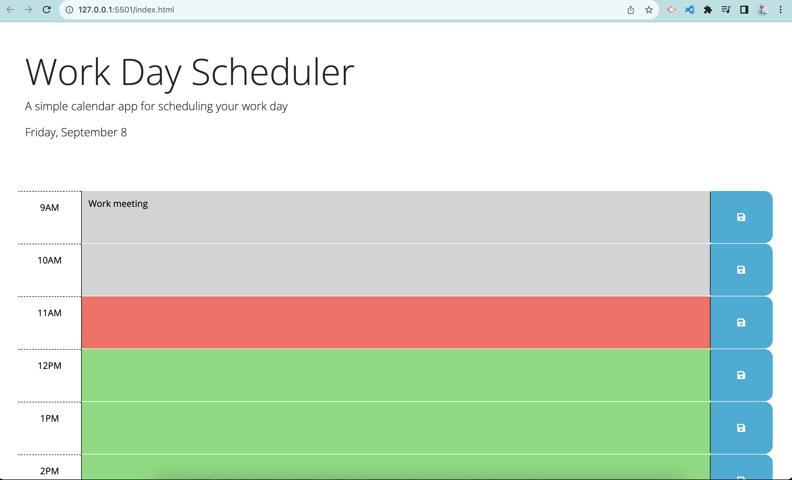

# Work Day Scheduler Webpage

## Description

The Work Day Scheduler Webpage can be utilized to plan the events of the day. Users can organize their day by typing all their tasks in the specified time blocks. These tasks can be saved even if the Scheduler is refreshed in the browser or the user leaves the page. The design of the Work Day Scheduler is visually enhanced by color changing time blocks. Each block represents an hour of the day from 9AM to 5PM, which is a typical work day. These time blocks change color based on if the time stamp is in the present (a red color block), past (grey color blocks), and future (green color blocks). With this design, users are able to easily see tasks that they are completing, tasks that they have completed, and tasks they will complete later on in the day. In addition to the updating time blocks, the current day, date, and day of the date is displayed at the top of the page for easy reference. The Work Day Scheduler Webpage is a useful tool for any user who wishes to keep their day's tasks organized.

This webpage is designed with HTML, CSS, and JavaScript. The HTML is the body of the page. The CSS applies styling and proper positioning. The JavaScript handles the logic needed for the color changing time blocks. Functions, conditional statements, jQuery selectors, jQuery methods, and local storage were implemented to complete the Scheduler. Furthermore, the day.js library was applied to handle the dates and times. JavaScript and the day.js library were essential in order to complete this webpage.

## Installation

No installation is neccesary. This is the link to the webpage: [Work Day Scheduler](https://cararosa.github.io/work-day-scheduler-challenge/).
A screenshot of the Scheduler in my browser is below:

## Credits

My teacher pointed out that the current time and the user time that I am comparing were not compatible. Based on his advice, I changed the id's values in each time block in order for the proper classes of past, present, and future to be applied. This code can be found in the index.html file. Daniel, a TA, noticed that i was calling the function loadEvents() inside of a function. Therefore, it was overwriting the anonymous function and clearing the text inside the unsaved time blocks when a user saved input in another box. Daniel advised me to delete the loadEvents() function inside of the anonymous function. After deleting the function, the text did not clear when a user saved text in another time block. This code was deleted from the script.js file.

## License

A license is not necessary.

